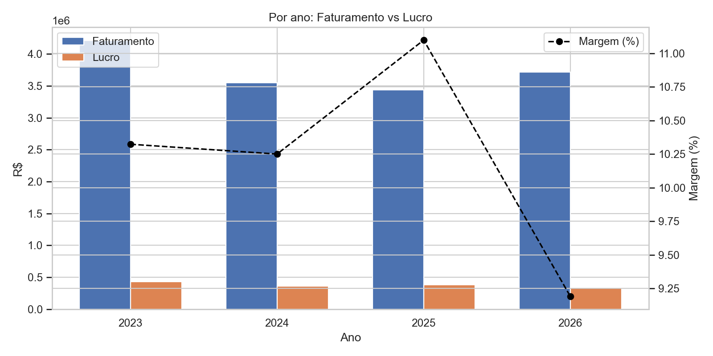

# Retail Store Sales Data — Recuperação de Margem (Análises Descritiva, Diagnóstica e Prescritiva)

[](https://www.python.org/)
[](https://pandas.pydata.org/)
[](LICENSE.md)
[](#publicação-no-github-pages)

[](https://flaviohenriquehb777.github.io/Retail_Store_Sales_Data/)

## Sumário
- [Visão Geral do Modelo](#visão-geral-do-modelo)
- [Objetivos da Análise](#objetivos-da-análise)
- [Estrutura do Modelo](#estrutura-do-modelo)
- [Base de Dados](#base-de-dados)
- [Metodologia](#metodologia)
- [Resultados Chave](#resultados-chave)
- [Dashboard (HTML)](#dashboard-html)
- [Tecnologias Utilizadas](#tecnologias-utilizadas)
- [Instalação e Uso](#instalação-e-uso)
- [Publicação no GitHub Pages](#publicação-no-github-pages)
- [Licença](#licença)
- [Contato](#contato)

## Visão Geral do Modelo
Este projeto consolida uma análise ponta a ponta de performance comercial, com foco na divergência entre crescimento de faturamento e estagnação (ou queda) da lucratividade. O trabalho é estruturado em três camadas:
- **Descritiva**: quantifica evolução de faturamento, lucro e margem; identifica padrões e recortes relevantes.
- **Diagnóstica**: explica *onde* e *por que* a margem deteriora (produto, logística, desconto, região, segmento).
- **Prescritiva**: recomenda ações executáveis (regras de desconto, preço efetivo, frete e guardrails) para recuperação de margem.

## Objetivos da Análise
- Medir e acompanhar **faturamento, lucro e margem** ao longo do tempo.
- Identificar **categorias, subcategorias e produtos** que comprimem a margem.
- Detectar **combinações críticas** (produto × envio × desconto × região × segmento).
- Propor um plano prescritivo com ações claras para:
  - **Estancar vendas com prejuízo**
  - Recuperar o **preço efetivo** (preço − desconto + frete)
  - Otimizar mix sem degradar margem

## Estrutura do Modelo
O repositório foi organizado para uso profissional e reprodutibilidade:
- `docs/`: conteúdo publicado no GitHub Pages (Dashboard).
  - `docs/index.html`: Dashboard (cópia do arquivo final).
  - `docs/assets/thumbnail.png`: miniatura usada neste README.
- `data/raw/`: base original (.xlsx).
- `reports/`: relatório executivo em `.docx`.
- `notebooks/`: notebooks para reprodução das análises.
- `src/`: scripts auxiliares (geração e ajustes do relatório).

## Base de Dados
- Arquivo: `Case 1 - Case Retail Store Sales Data.xlsx`
- Aba: `Sales_retail_store`
- Pasta (no projeto): `data/raw/`

## Metodologia
1. **Descritiva**
   - Séries mensais e anuais de faturamento, lucro e margem.
   - Ranking e participação por categoria/subcategoria/produto.
   - Distribuição de lucro por pedido e Pareto de contribuição de lucro.
2. **Diagnóstica**
   - Decomposição por recortes: categoria/subcategoria, envio, desconto, região, segmento.
   - Identificação de combinações com **margem negativa** e/ou alta participação no faturamento.
3. **Prescritiva**
   - Definição de **guardrails** (margem mínima por pedido; bloqueio de pedidos com prejuízo).
   - Ajustes de **preço efetivo** (preço, desconto e frete), segmentados por onde o problema ocorre.
   - Plano de implantação 30-60-90 dias com governança e métricas.

## Resultados Chave
Os principais achados e recomendações executivas estão consolidados no relatório:
- `reports/Relatorio_Executivo_Recuperacao_de_Margem_Acentuado.docx`

## Dashboard (HTML)
- Publicação (GitHub Pages):  
  https://flaviohenriquehb777.github.io/Retail_Store_Sales_Data/
- Arquivo publicado: `docs/index.html`
- Arquivo de referência (inalterado): `dashboard_retail_store_part1.html`

## Tecnologias Utilizadas
- **Python** (análises e automação do relatório)
- **pandas / numpy** (tratamento e agregações)
- **openpyxl** (leitura do `.xlsx`)
- **python-docx** (geração e edição do relatório)
- **HTML/CSS/JavaScript** (dashboard single-file)

## Instalação e Uso
### 1) Ambiente Python
```bash
python -m venv .venv
.\.venv\Scripts\activate
pip install -r requirements.txt
```

### 2) Executar notebooks
- Abra os notebooks em `notebooks/` (ex.: Jupyter Lab / VS Code).

### 3) Regerar relatório (opcional)
```bash
python src/gerar_relatorio_margem.docx.py
python src/adicionar_respostas_case_docx.py
python src/corrigir_acentos_docx.py reports/Relatorio_Executivo_Recuperacao_de_Margem_Acentuado.docx
```

## Publicação no GitHub Pages
Recomendação: publicar a partir da pasta `docs/`.
1. No GitHub: **Settings → Pages**
2. Em **Build and deployment**:
   - Source: **Deploy from a branch**
   - Branch: `main`
   - Folder: `/docs`
3. Salvar. O dashboard ficará acessível pela URL do GitHub Pages do repositório.

## Licença
Este projeto é distribuído sob a licença MIT. Consulte [LICENSE.md](LICENSE.md).

## Contato
- Nome: Flávio Henrique Barbosa
- LinkedIn:
- Email: flaviohenriquehb777@outlook.com

